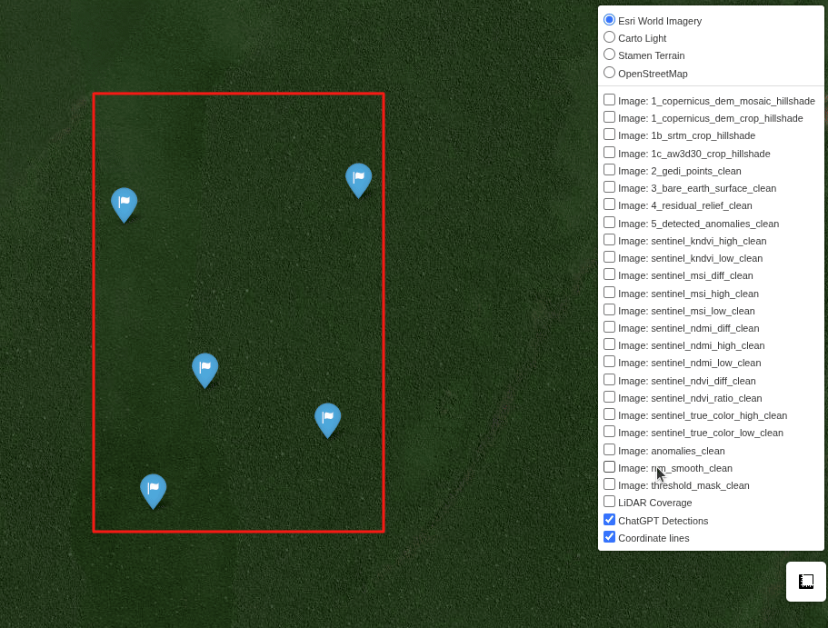
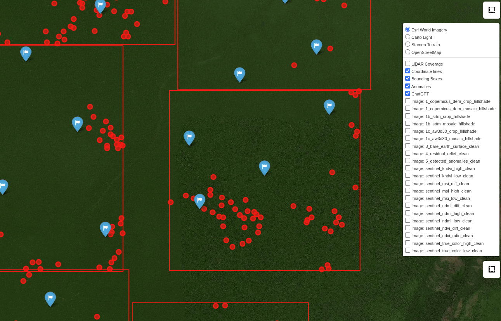

# Amazon Hidden Site Hunter

Python-based “digital machete” fuses DEM‑GEDI relief, NDVI‑type stress maps diffs & OpenAI o3 to unmask hidden Amazon man-made sites.

- [Amazon Hidden Site Hunter](#amazon-hidden-site-hunter)
- [Installation](#installation)
- [Usage](#usage)
- [Configuration](#configuration)
- [Viewing the results](#viewing-the-results)
  - [Interactive map per bbox](#interactive-map-per-bbox)
  - [Interactive map combined](#interactive-map-combined)
- [Overview](#overview)
- [How it works](#how-it-works)
- [Notes](#notes)

# Installation

1. Install uv: https://docs.astral.sh/uv/getting-started/installation/
2. `git clone git@github.com:Dene33/amazon-hidden-site-hunter.git`
3. `cd` to the project directory, then `uv sync` to spawn the environment and install dependencies

# Usage

1. Create a configuration file `your_config_name.yaml`, see the `pipeline_config.yaml` for an example`
2. Run the pipeline with your configuration file: `uv run your_config_name.yaml`

# Configuration

The configuration file is a YAML file that defines the pipeline steps and their parameters. The example `pipeline_config.yaml` contains the following steps/flags:
1. `fetch_data` - download [Copernicus](https://dataspace.copernicus.eu/explore-data/data-collections/copernicus-contributing-missions/collections-description/COP-DEM) DEM
2. `fetch_gedi_points` - download [GEDI](https://gedi.umd.edu/) points
3. `sentinel` - download sentinel bands and compute: kNDVI, MSI, NDVI for two periods of `high_stress` and `low_stress` and `difference` between them
4. `srtm` - [Shuttle Radar Topography Mission](https://science.nasa.gov/mission/srtm/) DEM
5. `aw3d` - [AW3D](https://www.aw3d.jp/en) DEM
6. `bare_earth` - computation of the DEM from GEDI points, using kriging
7. `residual_relief` - computation of the residual relief from the defined DEM and `bare_earth`
8. `detect_anomalies` - detection of anomalies in the `residual_relief` computing unnatural depressions and elevations
9. `interactive_map` - for every bbox, generate an interactive map with all the images embedded (sharable .html), anomalies highlighted, and OpenAI's o3 detections
10. `export_obj` - export `bare_earth` and `copernicus_dem` in 3D .obj format for further processing in Blender or other 3D software
11. `chatgpt` - use OpenAI's o3 to detect anomalies in the defined images. The output anomalies coordinates (and their descriptions) are highlighted on the interactive map, saved to a file, and can be used for further processing

# Viewing the results

## Interactive map per bbox

The results will be saved the directory `{out_dir}/{bbox}` where `{out_dir}` is defined in the configuration .yaml file and `{bbox}` is the bbox coordinates from the list of `bbox` defined in the configuration file.

Each step in the configuration .yaml file has `visualize` flag, which defines whether to generate the images for the step or not. All the images are available in the `{out_dir}/{bbox}` and also under `{out_dir}/{bbox}/debug`

The interactive .html map `{out_dir}/{bbox}/interactive_map.html` is generated for each bbox from the list of `bbox` of configuration .yaml. This map has all the images embedded so one can easily share it with others. It contains all the images, anomalies highlighted, and OpenAI's o3 detections.

You can check the examples of the generated interactive maps .html files [HERE](https://github.com/Dene33/openai-to-z-challenge-writeup/tree/main/data/maps).

## Interactive map combined

Additionally, if the `combined_bboxes_map` flag of the `interactive_map` step is set to `true`, a combined map for all bboxes will be generated in `{out_dir}/combined_map.html`. This map contains all the images from all bboxes, anomalies highlighted, and OpenAI's o3 detections. However, the images **are not embedded** in this map, so it is not as sharable as the individual bbox maps. To view this .html one needs all directories of bboxes to be present in the `{out_dir}` directory.

In the `combined_map.html` use `ctrl+click` on a bbox to enable its visibility. This allows you to focus on a specific bbox and view its anomalies and OpenAI's o3 detections. `alt+click` on a bbox will disable its visibility. Use the panel on the right side to toggle the visibility of each image layer.

I made the `combined_map.html` without the images embedded to keep the file size of .html small and avoid loading all the images at once, which can be slow and resource-intensive. For example, I processed 360 bboxes and for each bbox, there are ~7 images of various resolutions. The .html file size in that case will be huge, loading will be slow, and the browser will struggle to render it. The current approach solve this problem by loading images on demand when the bbox is clicked.

# Overview

[**Amazon Hidden Site Hunter**](https://github.com/Dene33/amazon-hidden-site-hunter) is a lightweight and super-powerful Python-based exploration tool developed to find hidden man-made structures in the Amazon. It helps to bring to life the legends about hidden Amazon civilizations using efficient anomaly highlighting and detection approaches, multi-range data (DEMs, GEDI, Sentinel2, etc), and state-of-the-art LLMs (OpenAI's o3).

It was used to find multiple hidden man-made structures in the Amazon, possibly including the legendary `Lost City of Z`. 

Amazon Hidden Site Hunter was created because I found no tools that suit my needs:
1. **Extendable**, python-based, open-source
2. **Lightweight**: not a monstrous application/framework
3. Fast, efficient and interactive data and results **viewer**: view all the generated images, anomalies, OpenAI's o3 detections
4. **Quick to install**: `git clone`, `uv sync` and boom! It's installed just in a couple of seconds on any machine
5. **Quick to start processing**: simply provide the bbox(es) of interest and run
6. **Sharable results**: All generated maps, anomalies, and findings can be easily shared with collaborators, only browser is needed to view the results

Having this all in mind and with the help of OpenAI's Codex, I've built the Amazon Hidden Site Hunter tool.

Amazon Hidden Site Hunter was extensively used during the development for the actual search of hidden man-made structures on the territories of: `Parque Indigena do Xingu`, `Cuzco`, `Acre`, `Terra Indigena Deni`, `Parque Nacional Do Jau`, `Guyana`, `Territorio Indigena Itonama (Bolivia)` which allowed me to itteratively improve the data analysis methods and the ease of use of the tool in general.

I can confidently say that this tool can become an indispensable tool for any anthropologist or archaeologist who wants to scan an area of ​​interest for hidden man-made structures without hassle of using heavy GIS software or complex frameworks.

# How it works
Amazon Hidden Site Hunter's pipeline consists of the number of sequential steps, that can be configured, turned on/off in the configuration `.yaml` file.

The pipeline consists of the following main steps:

1. **Bbox definition**: The user defines the area of interest by providing a bounding box (bbox) in the configuration file. This bbox can be defined as a single bbox or multiple bboxes, allowing for flexible exploration of different regions. It is easy to batch process multiple areas of interest by simply adding them to the configuration file.

1. **Terrain anomaly detection**: We calculate residual relief by comparing a digital elevation model (DEM) of the terrain with precise laser altimetry from NASA’s [GEDI](https://gedi.umd.edu/) LiDAR instrument. (GEDI’s spaceborne laser can penetrate the forest canopy to measure ground elevation with high accuracy). Kriging interpolation is used to fill in gaps and create a continuous surface from GEDI point data, allowing us to generate a detailed bare-earth DEM. By subtracting ground elevations (DEM's canopy vs GEDI's bare-earth), we highlight subtle bumps and depressions in the land – potential mounds, causeways, or ditch networks left by pre-Columbian societies. This DEM-vs-GEDI analysis served as a “x-ray” for unseen earthworks. 3 DEMs are available for the analysis: [Copernicus](https://dataspace.copernicus.eu/explore-data/data-collections/copernicus-contributing-missions/collections-description/COP-DEM), [SRTM](https://science.nasa.gov/mission/srtm) and [AW3D](https://www.aw3d.jp/en).

2. **Vegetation stress analysis**: We derive NDVI-like indices ([kNDVI](https://custom-scripts.sentinel-hub.com/sentinel-2/kndvi/), [MSI](https://custom-scripts.sentinel-hub.com/sentinel-2/msi/), [NDMI](https://custom-scripts.sentinel-hub.com/sentinel-2/ndmi/)) from [Sentinel2](https://sentinels.copernicus.eu/copernicus/sentinel-2) to identify areas of unusual plant stress or different vegetation health. Ancient constructions often alter soil and moisture, causing vegetation above to grow differently. By mapping low vs. high vegetation stress, the tool reveals hidden patterns – for example, linear or rectangular patches of stunted growth – that might outline buried roads, plazas, or building foundations under the jungle canopy.
   
3. **AI-driven pattern recognition**: Finally, we leverage OpenAI’s advanced [o3](https://platform.openai.com/docs/models/o3) model to analyze the generated relief and vegetation anomaly maps. o3 is tasked with spotting anything “non-natural” – such as geometric shapes or alignments unlikely to occur naturally. Essentially, o3 acts as an extra pair of expert eyes, scanning our maps for the telltale signatures of human-made structures (e.g. straight lines, right angles, circular mounds). This automated anomaly detection dramatically speeds up the search, ensuring no subtle clue was missed. Surprisingly, it works pretty well and outputs coordinates of the detected anomalies, which usually correspond to the anomalies highlighted in the previous steps and visually consistent with the generated maps.

# Notes
If a bbox spans multiple Sentinel-2 tiles only the portion that lies inside the
available tile will be downloaded. The pipeline logs a message in this case and
continues processing with the partial data. Try adjusting `max_cloud` or the
`time_start`/`time_end` values if full coverage is required.
